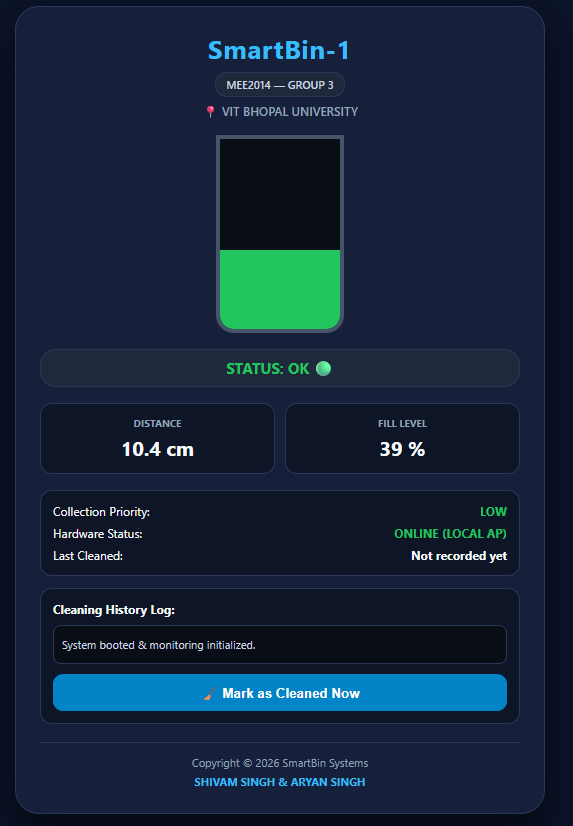
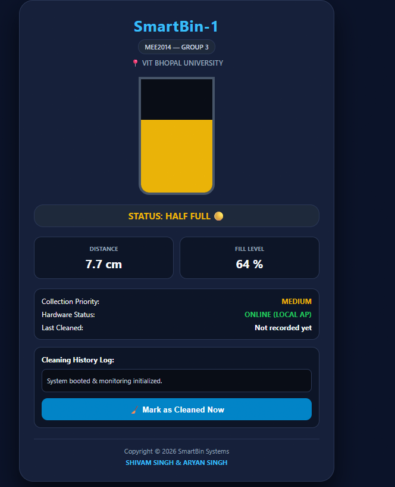
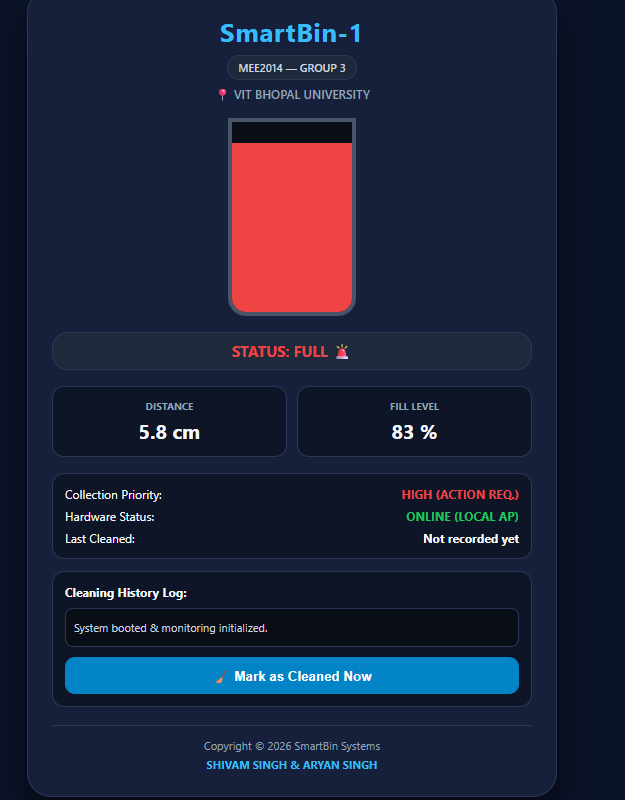

<div align="center">

# 🗑️ SmartBin-1

### Automated IoT Waste-Level Monitoring & Alert System

An ESP32-based smart bin that measures its own fill level with ultrasonic ranging, signals it with LEDs and a buzzer, and streams live data to any phone over its **own Wi-Fi hotspot — no internet required.**


**MEE2014 · Group 3 · VIT Bhopal University**

</div>

---

## 📸 Live Dashboard

| OK (39 %) | Half Full (64 %) | Full (83 %) |
|:---:|:---:|:---:|
|  |  |  |

## ✨ Features

- **Contactless fill measurement** with an HC-SR04 ultrasonic sensor
- **Calibrated fill percentage** (0–100 %) for a 14.4 cm deep container
- **3-level local alerts:** green (OK), yellow (half full), red + buzzer (full)
- **Standalone Wi-Fi Access Point:** the ESP32 hosts its own network, so no router or internet is needed
- **Embedded responsive dashboard** with animated bin, status pill, collection priority and cleaning log
- **JSON telemetry endpoint** (`/data`) that is easy to reuse in other apps
- **Serial output** at 115200 baud for debugging

## 🧰 Hardware

| Component | Qty | Purpose |
|---|:---:|---|
| ESP32 DevKit V1 (30-pin) | 1 | Controller + Wi-Fi Access Point |
| HC-SR04 ultrasonic sensor | 1 | Distance measurement |
| 1 kΩ resistor | 3 | ECHO voltage divider (1 kΩ + 2 × 1 kΩ in series) |
| 220 Ω resistor | 3 | LED current limiting |
| LEDs (green, yellow, red) | 3 | Status indication |
| Active piezo buzzer (5 V) | 1 | Audible alarm |
| Breadboard + jumper wires | – | Prototyping |
| Micro-USB data cable | 1 | Power and programming |

## 🔌 Wiring

> ⚠️ **Do not connect HC-SR04 `ECHO` directly to the ESP32.** ECHO outputs 5 V but ESP32 GPIOs are 3.3 V devices. Use the voltage divider below.

```
HC-SR04 ECHO ──[ 1 kΩ ]──┬── ESP32 GPIO18   (≈ 3.33 V)
                         │
                    [ 2 kΩ ]   (two 1 kΩ in series)
                         │
                        GND
```

| From | Pin | To |
|---|---|---|
| ESP32 | `VIN` (5 V) | Red power rail (+) |
| ESP32 | `GND` | Blue ground rail (−) |
| HC-SR04 | `VCC` | 5 V rail |
| HC-SR04 | `GND` | GND rail |
| HC-SR04 | `TRIG` | `GPIO5` |
| HC-SR04 | `ECHO` | 1 kΩ → divider node → `GPIO18` |
| Green LED | anode | `GPIO14` (cathode → 220 Ω → GND) |
| Yellow LED | anode | `GPIO27` (cathode → 220 Ω → GND) |
| Red LED | anode | `GPIO26` (cathode → 220 Ω → GND) |
| Active buzzer | `+` | `GPIO25` (− → GND) |

## 🚀 Getting Started

### 1. Install the tools
1. Install [Arduino IDE 2.x](https://www.arduino.cc/en/software).
2. Add this URL under **File → Preferences → Additional Boards Manager URLs**:
   `https://raw.githubusercontent.com/espressif/arduino-esp32/gh-pages/package_esp32_index.json`
3. Open **Tools → Board → Boards Manager**, search `esp32` and install it.
4. If the board isn't detected on Windows, install the **CP210x** or **CH340** USB driver.

### 2. Flash the firmware
1. Open `firmware/SmartBin_Local/SmartBin_Local.ino`.
2. Select **ESP32 Dev Module** and the correct COM port.
3. Click **Upload**. If it shows `Connecting...___`, hold the **BOOT** button until writing starts.

### 3. View the dashboard
1. Join Wi-Fi **`SmartBin-WiFi`** (password **`12345678`**).
2. Turn **mobile data off** on your phone so it doesn't bypass the offline network.
3. Open **http://192.168.4.1** in a browser.

> 🔒 Change `AP_SSID` and `AP_PASS` in the sketch before any real deployment.

## 📐 How It Works

The sensor measures the round-trip time of a 40 kHz ultrasonic burst:

```
distance (cm) = echo_time_µs × 0.0343 / 2
fill (%)      = (14.4 − distance) / (14.4 − 4.0) × 100
```

| Distance | Fill | LED | Buzzer | Dashboard |
|---|:---:|:---:|:---:|---|
| > 9.2 cm | < 50 % | Green | Off | OK |
| 6.08 – 9.2 cm | 50 – 79 % | Yellow | Off | HALF FULL |
| ≤ 6.08 cm | ≥ 80 % | Red | On (2500 Hz) | FULL |

Worst-case ranging error is about **±2.88 %** (±0.3 cm over a 10.4 cm span).

### API

| Endpoint | Returns |
|---|---|
| `GET /` | The dashboard web page |
| `GET /data` | `{"distance": 5.8, "fill": 83, "status": "FULL"}` |

### Calibrating for your own bin
Edit these two constants in the sketch:

```cpp
const float BIN_DEPTH_CM      = 14.4; // sensor → bottom of empty bin
const float FULL_THRESHOLD_CM = 4.0;  // sensor → waste surface when "100 % full"
```

## ⚠️ Known Limitations

- Soft or steeply angled waste can absorb or deflect ultrasound, causing a lost echo (reported as empty).
- The sensor reads a single point, so uneven piles can misrepresent volume.
- Wi-Fi range is roughly 15–30 m line-of-sight, and the ESP32 hotspot supports only a few simultaneous clients.
- The cleaning history lives in the browser and resets on page reload.

## 🗺️ Roadmap

- [ ] LoRaWAN / NB-IoT for long-range cloud telemetry
- [ ] Solar panel + 18650 battery with deep-sleep firmware
- [ ] Central platform with automatic collection-route optimisation

## 📁 Repository Structure

```
SmartBin-1/
├── firmware/
│   └── SmartBin_Local/
│       └── SmartBin_Local.ino     # ESP32 firmware + embedded dashboard
├── docs/
│   └── SmartBin-1_Project_Report.pdf
├── images/                        # Dashboard screenshots
├── .gitignore
├── LICENSE
└── README.md
```

## 📄 Documentation

The complete project report (architecture, schematics, calibration maths, test results and business model) is in [`docs/SmartBin-1_Project_Report.pdf`](docs/SmartBin-1_Project_Report.pdf).

## 👥 Authors

| Name | Registration No. |
|---|---|
| **Shivam Singh** | 25BCE10736 |
| **Aryan Singh** | 25BCE10798 |

School of Computer Science and Engineering (SCOPE), **VIT Bhopal University**, Kotri Kalan, Ashta, Sehore – 466114, Madhya Pradesh, India.

## 📜 License

Released under the [MIT License](LICENSE).
